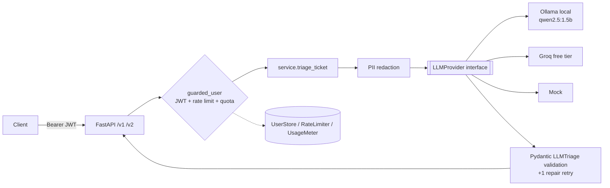

# Architecture

## Request lifecycle
1. **Auth** – `OAuth2PasswordBearer` extracts the token; `decode_token` enforces signature, algorithm allow-list and required `exp`/`sub`; the user must still exist.
2. **Controls** – sliding-window limiter (default 10/min) then daily token quota. Both fail with `429` + `Retry-After`.
3. **Validation** – `TriageRequest` (`extra="forbid"`, text bounds, optional tier/channel/product) → `422` on violation.
4. **Redaction** – emails, phones, card numbers replaced with `[EMAIL]` etc. before inference.
5. **Inference** – provider called with the JSON schema of `LLMTriage` (queue, SLA, severity, risks, actions…).
6. **Contract check** – output re-validated with Pydantic; one repair retry, then `502`.
7. **Ops enrichment** – server attaches ticket id, latency, channel/tier echo, PII counts.
8. **Metering** – prompt+completion tokens added to the user's daily usage.

## Why this is more than a basic classifier
Many demos stop at `category` + `priority`. TriageForge returns an **operations pack**: 12-category taxonomy, assigned queue, SLA hours, severity 1–10, escalation decision, risk flags, keywords, and concrete next actions — plus a public `/v1/taxonomy` map for schema transparency.

## Service boundaries & decisions
| Decision | Rationale |
|---|---|
| `LLMProvider` Protocol | Model is a swappable dependency; handlers never import a vendor SDK; tests use `Mock` |
| Shared `httpx.AsyncClient` in lifespan | Connection pooling, clean shutdown |
| Separate `LLMTriage` (model contract) from `TriageV2` (API contract) | Model output is untrusted input; API fields (id, latency, PII) are server-owned |
| v1 derived from v2 core | One code path; old clients keep a frozen shape |
| In-memory stores behind small classes | Zero-dependency demo; interface mirrors what a Redis/Postgres adapter needs |
| Small default model (1.5B) | Runs on a laptop CPU; swap `OLLAMA_MODEL` for quality (trade-off: latency vs accuracy) |

## Security notes
Secrets via env only (fail-fast ≥32 chars); bcrypt; non-root container; PII never sent to model; generic 401s (no user enumeration on token errors). Production: rotate keys, add HTTPS termination, move to asymmetric JWT (RS256/EdDSA) and a real IdP.

## Scaling path
Stateless API pods → Redis for limits/quota → Postgres for users → dedicated GPU inference tier (vLLM/Ollama) behind the same `LLMProvider` interface.
